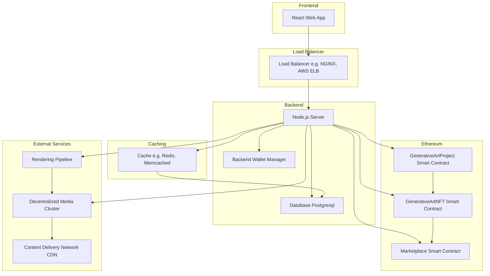

# gen-art-platform

Study Case Overview

In this case study, we'll be creating a Generative Art platform on the Ethereum blockchain. This platform will allow artists to publish their projects, and users can mint unique iterations of these projects as NFTs. We'll be focusing on the implementation of core smart contracts and providing a high-level overview of the system architecture.

Deliverables:

1. Smart Contracts in Solidity
2. Schema of the system architecture
3. Explanations of various system components
4. Rough projection of the implementation schedule

Smart Contracts

We will be implementing two core smart contracts for this application:

1. GenerativeArtProject: This contract will handle the creation and management of generative art projects. It will store project details, minting rules, and splits for funds distribution.
2. GenerativeArtNFT: This contract will handle the minting, revealing, and trading of NFTs associated with the generative art projects.

System Architecture

The system architecture consists of the following components:

1. Frontend: A web application built using React and TypeScript, allowing users to browse, mint, and trade NFTs.
2. Backend: A Node.js server built using TypeScript and Express, handling API requests and interacting with the Ethereum blockchain.
3. Database: A PostgreSQL database for storing data created by the smart contracts.
4. Rendering Pipeline: A module for generating images from the generative art code.
5. Decentralized Media Cluster: A module for storing and serving files, such as project details and NFT metadata.
6. Marketplace Smart Contract: A smart contract for trading NFTs.
7. Backend Wallet Manager: A module for securely managing on-chain operations in the backend.

Implementation Schedule

1. Week 1-2: Design and implement the GenerativeArtProject and GenerativeArtNFT smart contracts.
2. Week 3-4: Develop the backend server and API, including database schema and integration with smart contracts.
3. Week 5-6: Implement the frontend application for browsing, minting, and trading NFTs.
4. Week 7-8: Integrate the rendering pipeline and decentralized media cluster with the backend server.
5. Week 9-10: Test the entire system, including smart contracts, frontend, and backend components.
6. Week 11-12: Deploy the platform to a test network and perform user testing and bug fixing.

Improvement Proposals

1. Implement different pricing strategies for minting NFTs, such as Step Dutch Auction and Linear Dutch Auction.
2. Provide a feature for users to stake their NFTs and earn rewards based on the popularity of the project.
3. Implement a governance system for the platform, allowing users to vote on upgrades and new features.

GenerativeArtProject.sol:

```solidity
pragma solidity ^0.8.0;

import "@openzeppelin/contracts/token/ERC721/IERC721.sol";
import "./GenerativeArtNFT.sol";

contract GenerativeArtProject {
    struct Project {
        string name;
        uint256 editions;
        uint256 price;
        uint256 openingTime;
        string codePointer;
        string detailsPointer;
        address[] splits;
        uint256[] percentages;
        uint256 royalties;
    }

    mapping(uint256 => Project) public projects;
    uint256 public projectCount;

    event ProjectCreated(uint256 indexed projectId, address indexed creator);

    function createProject(
        string memory _name,
        uint256 _editions,
        uint256 _price,
        uint256 _openingTime,
        string memory _codePointer,
        string memory _detailsPointer,
        address[] memory _splits,
        uint256[] memory _percentages,
        uint256 _royalties
    ) external {
        require(_editions > 0, "Invalid number of editions");
        require(_price > 0, "Invalid price");
        require(_splits.length == _percentages.length, "Splits and percentages length mismatch");

        uint256 projectId = projectCount++;
        projects[projectId] = Project({
            name: _name,
            editions: _editions,
            price: _price,
            openingTime: _openingTime,
            codePointer: _codePointer,
            detailsPointer: _detailsPointer,
            splits: _splits,
            percentages: _percentages,
            royalties: _royalties
        });

        emit ProjectCreated(projectId, msg.sender);
    }
}
```

GenerativeArtNFT.sol:

```solidity
pragma solidity ^0.8.0;

import "@openzeppelin/contracts/token/ERC721/extensions/ERC721Enumerable.sol";
import "@openzeppelin/contracts/access/Ownable.sol";
import "./GenerativeArtProject.sol";

contract GenerativeArtNFT is ERC721Enumerable, Ownable {
    using Strings for uint256;

    GenerativeArtProject public artProject;
    uint256 public nftCount;
    mapping(uint256 => uint256) public tokenProject;
    mapping(uint256 => bytes32) public tokenSeed;
    mapping(uint256 => string) private _tokenURIs;

    event NFTMinted(uint256 indexed tokenId, address indexed minter);

    constructor(address _artProject) ERC721("GenerativeArtNFT", "GANFT") {
        artProject = GenerativeArtProject(_artProject);
    }

    function mint(uint256 _projectId) external payable {
        GenerativeArtProject.Project memory project = artProject.projects(_projectId);

        require(project.editions > 0, "Project sold out");
        require(msg.value >= project.price, "Insufficient payment");
        require(block.timestamp >= project.openingTime, "Project not open yet");

        uint256 tokenId = nftCount++;
        _safeMint(msg.sender, tokenId);

        tokenProject[tokenId] = _projectId;
        tokenSeed[tokenId] = keccak256(abi.encodePacked(block.timestamp, msg.sender, tokenId));

        project.editions--;

        emit NFTMinted(tokenId, msg.sender);
    }

    function setTokenURI(uint256 tokenId, string memory _tokenURI) external onlyOwner {
        require(_exists(tokenId), "Token does not exist");
        _tokenURIs[tokenId] = _tokenURI;
    }

    function tokenURI(uint256 tokenId) public view virtual override returns (string memory) {
        require(_exists(tokenId), "Token does not exist");

        string memory _tokenURI = _tokenURIs[tokenId];
        return bytes(_tokenURI).length > 0 ? _tokenURI : "";
    }

    function _beforeTokenTransfer(address from, address to, uint256 tokenId) internal virtual override(ERC721Enumerable) {
        super._beforeTokenTransfer(from, to, tokenId);
    }

    function supportsInterface(bytes4 interfaceId) public view virtual override(ERC721Enumerable) returns (bool) {
        return super.supportsInterface(interfaceId);
    }
}
```

To handle a large volume of requests (2000 req/s) in a public API that exposes the internal database, we need to ensure that the architecture is designed to be scalable, efficient, and robust. Here are some strategies and best practices to achieve this:

1. Use a load balancer: Deploy a load balancer, such as AWS Elastic Load Balancer or NGINX, to distribute incoming traffic across multiple instances of the API server. This helps to ensure that no single server is overwhelmed with traffic and helps to maintain high availability.

2. Implement horizontal scaling: Design the API server to be stateless, so that it can be easily scaled horizontally by adding more instances as needed. This can be achieved using containerization technologies like Docker and orchestration tools like Kubernetes.

3. Use a caching mechanism: Implement caching at various levels (in-memory, server-side, or client-side) to reduce the load on the database and improve response times. Popular caching solutions include Redis, Memcached, or even a CDN for caching static assets.

4. Rate limiting: Implement rate limiting to prevent abuse of the API and to ensure fair usage among clients. Rate limiting can be applied at various levels, such as IP address, user account, or API key.

To fulfill the requirements of the users and artists on the platform, we would need the following API endpoints:

1. User Authentication and Authorization

```bash
   - POST /auth/register: Register a new user account
   - POST /auth/login: Authenticate and log in a user
   - GET /auth/user: Get the currently authenticated user's details
```

2. Generative Art Projects

```bash
   - POST /projects: Create a new generative art project
   - GET /projects: List all generative art projects
   - GET /projects/:id: Get a specific generative art project by ID
   - PUT /projects/:id: Update a specific generative art project by ID
   - DELETE /projects/:id: Delete a specific generative art project by ID
```

3. NFT Minting

```bash
   - POST /nfts/mint: Mint a new NFT for a specific project
   - GET /nfts/:id: Get a specific NFT by ID
   - PUT /nfts/:id/reveal: Reveal a specific NFT by ID, updating its metadata
```

4. NFT Trading

```bash
   - POST /nfts/:id/sell: List an NFT for sale
   - POST /nfts/:id/cancel: Cancel an NFT sale listing
   - POST /nfts/:id/buy: Buy an NFT listed for sale
   - POST /nfts/:id/offer: Make an offer on an NFT
   - POST /nfts/:id/accept: Accept an offer on an NFT
   - POST /nfts/:id/reject: Reject an offer on an NFT
```

5. Market Statistics

```bash
   - GET /stats/overall: Get overall platform statistics
   - GET /stats/projects/:id: Get statistics for a specific generative art project
```

6. User Collections

```bash
   - GET /users/:id/collection: Get the NFT collection for a specific user
```

7. Decentralized Media Cluster

```bash
   - POST /media: Upload a file to the decentralized media cluster
   - GET /media/:id: Get a file from the decentralized media cluster by ID
```

8. Rendering Pipeline

```bash
   - POST /render: Generate an image from generative art code and unique seed
```

Database schema:

Table 1: GenerativeArtProjects

This table stores the project details, minting rules, and splits for funds distribution. The columns for this table include:

```bash
id: Unique ID for the project
name: Name of the project
editions: Total number of editions available for the project
price: Price per edition in ETH
opening_time: Time when the project opens for minting
code_pointer: Pointer to the generative art code
details_pointer: Pointer to the project details
royalties: Percentage of royalties to be distributed to the artist
created_at: Timestamp for the project creation
```

Table 2: GenerativeArtNFTs

This table stores the NFTs associated with the generative art projects. The columns for this table include:

```bash
id: Unique ID for the NFT
project_id: The ID of the project associated with this NFT
seed: The seed used to generate the NFT
minted_at: Timestamp for the NFT minting
owner: Ethereum address of the NFT owner
```

Table 3: GenerativeArtNFTMetadata

This table stores the metadata associated with the NFTs. The columns for this table include:

```bash
id: Unique ID for the metadata
nft_id: The ID of the NFT associated with this metadata
metadata: JSON-formatted metadata for the NFT
```

Table 4: GenerativeArtTransactions

This table stores the transactions associated with the NFTs. The columns for this table include:

```bash
id: Unique ID for the transaction
nft_id: The ID of the NFT associated with this transaction
type: The type of transaction (mint, transfer, sale)
amount: The amount of ETH involved in the transaction
from_address: Ethereum address of the sender
to_address: Ethereum address of the receiver
created_at: Timestamp for the transaction creation
```

Table 5: GenerativeArtUsers

This table stores the user details of the platform. The columns for this table include:

```bash
id: Unique ID for the user
ethereum_address: Ethereum address of the user
username: Username of the user
created_at: Timestamp for the user creation
```

Table 6: GenerativeArtVotes

This table stores the votes cast by the users for the governance system. The columns for this table include:

```bash
id: Unique ID for the vote
user_id: The ID of the user who cast the vote
project_id: The ID of the project associated with this vote
vote: The vote cast (for or against)
created_at: Timestamp for the vote creation
```

Table 7: GenerativeArtStakes

This table stores the stakes made by the users to earn rewards based on the popularity of the project. The columns for this table include:

```bash
id: Unique ID for the stake
user_id: The ID of the user who made the stake
nft_id: The ID of the NFT associated with this stake
amount: The amount of ETH staked
created_at: Timestamp for the stake creation
```



Conclusion

In this case study, we have outlined the requirements, system architecture, and implementation schedule for a Generative Art platform on Ethereum. By implementing core smart contracts and designing a scalable system architecture, we can create a platform that allows artists to showcase their work and users to mint and trade unique NFTs.
